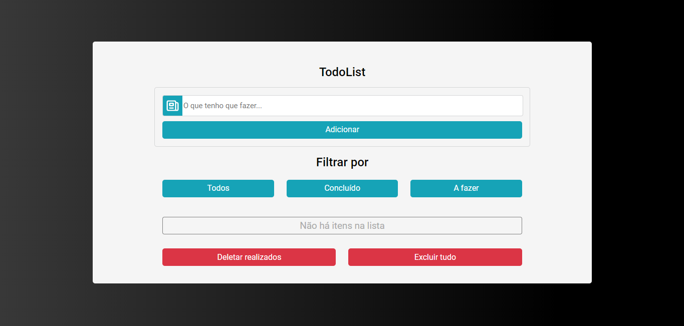
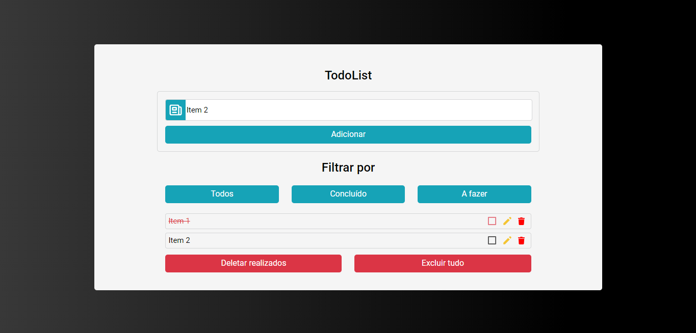

<h1>TO DO LIST</h1>

> Lista de tarefas vazia
 

 

> Lista de tarefas com itens
 

 

> <h3>Descrição do projeto</h3>

 

 O projeto "Lista de Tarefas" é uma aplicação web desenvolvida utilizando React, JavaScript, React Icons, Styled Components e a biblioteca UUID. A aplicação tem como objetivo permitir que os usuários criem e gerenciem suas listas de tarefas de forma fácil e intuitiva.

 ---
 

 

 > <h4>Principais funcionalidades:</h4>

  

 - Adicionar Item: 
  - - Os usuários podem adicionar novas tarefas à lista fornecendo uma descrição para a tarefa. Ao clicar no botão "Adicionar", a tarefa é incluída na lista.
   
   
  
 ---
 - Editar Item: 
  - - É possível editar uma tarefa existente na lista. Os usuários podem modificar a descrição da tarefa e salvar as alterações. Isso permite que as tarefas sejam atualizadas conforme necessário.
   
   
  
 ---
  - Excluir Item: 
   - - Os usuários têm a opção de excluir uma tarefa da lista. Ao clicar no botão de exclusão associado a uma tarefa, ela é removida permanentemente da lista.
    
   
  
 ---
  - Marcar como Concluída: 
   - - Os usuários podem marcar uma tarefa como concluída, indicando que ela foi realizada. Essa funcionalidade permite que os usuários acompanhem seu progresso e visualizem quais tarefas já foram concluídas.
    
   
  
 ---
  - Listar Todos os Itens: 
   - - Existe um botão que permite exibir todas as tarefas presentes na lista, independentemente do seu status (concluída ou não concluída).
  
   

 ---
  - Listar Apenas Concluídos: 
   - - Um botão específico permite filtrar a lista e mostrar apenas as tarefas que foram concluídas.
  
   

 ---
  - Listar Apenas Não Concluídos: 
   - - Há um botão que permite filtrar a lista e exibir apenas as tarefas que ainda não foram concluídas.
  
   

 ---
  - Excluir Somente os Concluídos: 
  - - Os usuários têm a opção de excluir permanentemente todas as tarefas que foram marcadas como concluídos anteriormente. Isso ajuda a limpar a lista de tarefas, removendo definitivamente as tarefas que não são mais relevantes.
  
   

 ---
  - Excluir Todos os Itens: 
  - - Existe um botão para excluir todas as tarefas da lista de uma só vez. Essa funcionalidade é útil quando o usuário deseja começar do zero ou limpar completamente a lista.
 ---